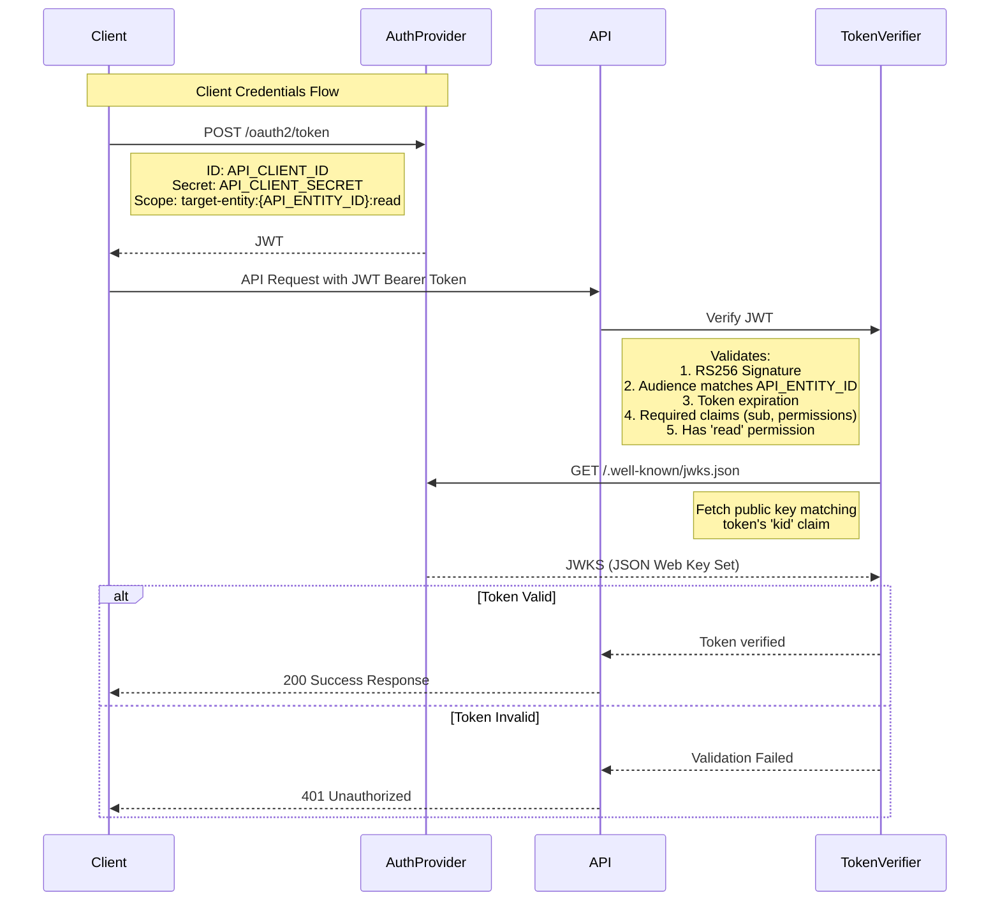

# PR Description Examples

## Bug Fix

Fixes an issue where configuration values weren't updating correctly when users interacted with the input controls.

The settings UI is wrapped by the `settings-manager` controller, which coordinates three instances of `input-control` and one `visualization-chart`. These controllers communicate using [event dispatch](https://example.com/docs/event-coordination). When an input changes, it dispatches a `value-changed` event that's received by the parent controller, which then dispatches `set-value` events to update the other inputs and a `config-updated` event that triggers the chart to update.

The bug was that events weren't being properly routed between controllers. This is now fixed by explicitly mapping events as `event->trigger` pairs in the controller actions.

## Major Feature

This PR implements machine-to-machine authentication for the API endpoints using [OAuth 2.0 client credentials flow](https://oauth.net/2/grant-types/client-credentials/).



I updated the ENV var names for clarity and injected `.env` into the Docker Compose auth container so values can be referenced in the configuration script.

For tests, I included the ability to manually set up a JWKS rather than fetching public keys from the auth provider's endpoint. This makes it easier to set up different scenarios while still exercising the JWT verification step on every request.

To get everything set up locally, rebuild your auth instance:

```
docker-compose down -v
bin/setup
```

Or if you want to keep your dev database:

```
docker-compose down -v auth
docker compose exec db psql -U postgres -c "DROP DATABASE IF EXISTS authdb;"
bin/setup
```

### apicurl
For API requests locally in dev, I included a script that handles the auth flow using values in your `.env` file:

```
bin/apicurl http://localhost:3000/api/resources/123
```

### Followup work
* Associate organization / web login with entity client credentials and display client ID and secret to user in web UI
* API doc updates explaining auth flow, token expiry, how to get credentials
* A script that makes it easy to create organizations / users / entities for new customers

## Code Refactor

Making it easier to extend a query with additional filters (without mutating the original object), similar to how ActiveRecord relations work.

* Removes the `MetricsCounts` controller concern. Rather than requiring controllers to mix-in this concern and call a helper method before rendering, this logic now lives directly in the component where it's used
* Removes `QueryTerms`. Term normalization is now being done in `Query::Parser` and code that cares about filters is interacting with a query object rather than bare query strings
* Moves the link construction for individual UI elements into the view component
* Moves filtering of query params out of the parser and into `Query`. This way `Query#filters` returns all filters from the parsed query, not just the filtered ones, and the parser is only concerned with parsing
* Adds a `Query#exclude` to remove filters from a query (opposite of `Query#where`)
* Breaks the stats bar partial out of the results partial so it's easier to control where the stats bar is rendered
* Adds our first [ViewComponent test](https://viewcomponent.org/guide/testing.html). The main benefit of using components is the ability to localize the logic and markup to render a piece of UI, which gives you much higher cohesion than having helpers and concerns coordinating across views and controllers. And because components are just objects they're easy to test, with or without actually rendering anything.

Side note: we should always try to avoid using instance variables inside partials. Inside top-level views is ok, since those are implicitly coupled to a controller action where those ivars are set. Partials are meant to be more modular though and relying on ivars makes assumptions about the contexts in which those partials will be rendered in the future. Better (and more flexible) to pass explicit local variables when rendering the partial.

More PRs to follow that will continue simplifying code by leaning on query objects. I'm trying to feel out the domain model by looking at what other code wants from a query in an abstract sense and what buckets of responsibility start to appear.

Querying and filtering data is core to both the web and API, so it's worth building out a rich model here that can help the rest of the code avoid complexity, but someone please stop me if I go overboard with the bells and whistles 😂

Part of [PROJ-123 Use Query objects in places we care about the filters](https://example.com/issue/PROJ-123)