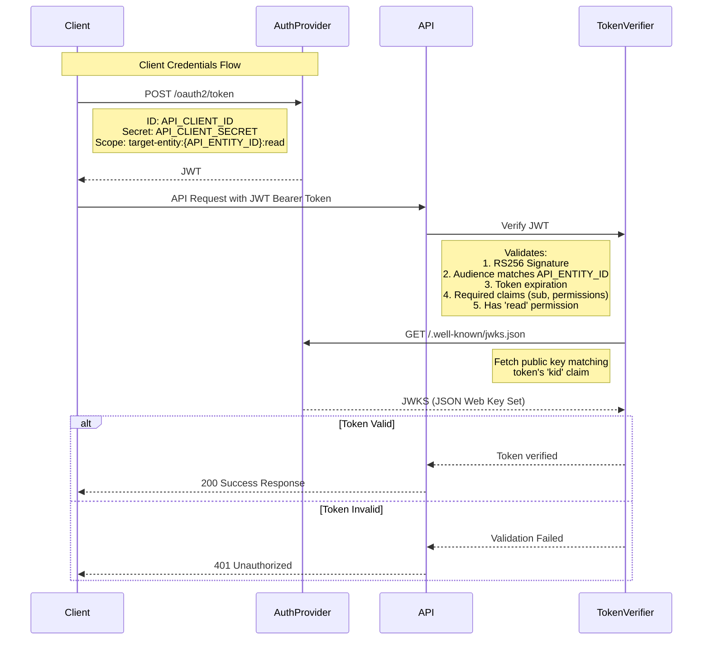

# PR Description Examples

## Bug Fix

Fixes configuration values not updating when users interact with input controls.

The settings UI coordinates three `input-control` instances and one `visualization-chart` through the parent `settings-manager` controller. Controllers communicate via [event dispatch](https://example.com/docs/event-coordination): input changes trigger `value-changed` events to the parent, which broadcasts `set-value` events to sibling inputs and `config-updated` to refresh the chart.

The root cause: events weren't properly routed between controllers. Fixed by explicitly mapping events as `event->trigger` pairs in controller actions.

## Major Feature

Implements machine-to-machine authentication for API endpoints using [OAuth 2.0 client credentials flow](https://oauth.net/2/grant-types/client-credentials/).



### Key Changes

* Clarified ENV variable names and injected `.env` into Docker Compose auth container for configuration script access
* Added manual JWKS setup for tests—enables different test scenarios while maintaining JWT verification on every request

### Local Setup

Rebuild your auth instance:

```
docker-compose down -v
bin/setup
```

Or preserve your dev database:

```
docker-compose down -v auth
docker compose exec db psql -U postgres -c "DROP DATABASE IF EXISTS authdb;"
bin/setup
```

### apicurl Helper

New script handles auth flow using `.env` values for local development:

```
bin/apicurl http://localhost:3000/api/resources/123
```

### Next Steps

* Link organization/web login with entity client credentials; expose client ID and secret in web UI
* Document auth flow, token expiry, and credential acquisition
* Create script for provisioning new customer organizations/users/entities

## Code Refactor

Simplifies query extension with additional filters (without mutation), following ActiveRecord's relation pattern.

### Changes

* **Removed `MetricsCounts` concern** – Logic now lives directly in the component rather than requiring controllers to mix in and call helpers
* **Removed `QueryTerms`** – Term normalization moved to `Query::Parser`; consumers now interact with query objects instead of raw strings
* **Relocated link construction** – UI element links now built in view components where they belong
* **Separated parser responsibilities** – `Query#filters` returns all parsed filters; parser focuses solely on parsing
* **Added `Query#exclude`** – Inverse of `Query#where` for removing filters
* **Extracted stats bar partial** – Split from results partial for better rendering control
* **Added ViewComponent test** – Components localize UI logic and markup for higher cohesion than helper/concern coordination. [Testing is straightforward](https://viewcomponent.org/guide/testing.html) since components are plain objects.

### Technical Note

Avoid instance variables in partials—they couple partials to specific controller contexts. Top-level views can use ivars (they're inherently coupled to controller actions), but partials should receive explicit locals for modularity.

### What's Next

Future PRs will continue leveraging query objects for simplification. I'm discovering the domain model by examining what abstractions other code needs from queries and identifying natural responsibility boundaries.

Since querying and filtering are fundamental to both web and API, building a robust model here reduces complexity throughout the codebase. (Please rein me in if the abstractions get too elaborate 😂)

Part of [PROJ-123 Use Query objects in places we care about the filters](https://example.com/issue/PROJ-123)